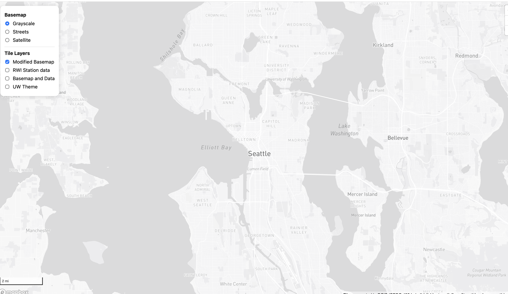
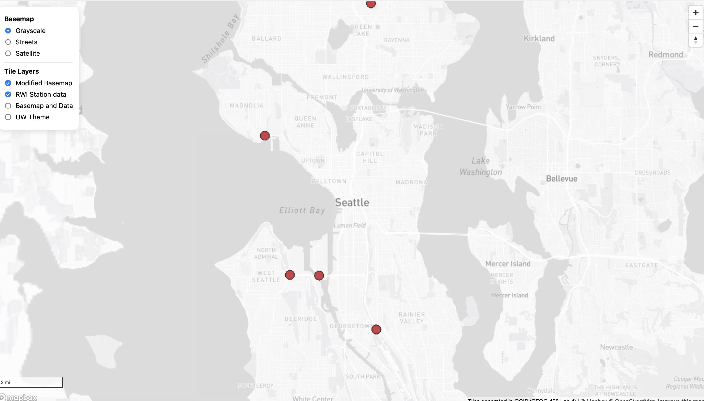
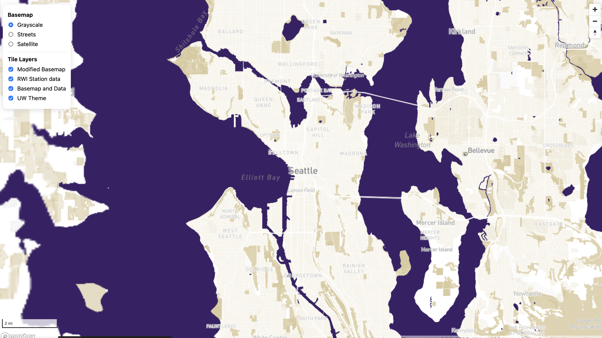

# GEOG 458 Lab 4: Tile Generation and Interactive Web Map

## Live Web Map

Access the live web map [here](http://127.0.0.1:5500/index.html). This
web map was created using **Mapbox GL JS** and displays multiple tile
layers that can be toggled using a layer switcher.

## Study Area

The geographic focus of this project is **Seattle, Washington and
surrounding areas**, including parts of West Seattle, Mercer Island,
Bellevue, and nearby communities around Puget Sound.

The tiles were generated only for this region in order to reduce the
number of tiles uploaded to GitHub.

## Tile Sets

#### Tile Set 1 Modified Basemap

This tile set is a customized basemap derived from Mapbox layers.\
The color scheme was simplified to emphasize geographic context while
keeping the design visually minimal. The basemap highlights roads,
labels, and water features while maintaining a clean background.

**Zoom Levels:** 10–13

### Tile Set 2 RWI Station Data (Thematic Layer)

This tile set represents a thematic dataset showing **Road Weather
Information (RWI) stations** across the Seattle area. The stations are
visualized as red points, allowing users to quickly identify the
distribution of weather monitoring locations.

**Zoom Levels:** 10–13

Screenshot:

### Tile Set 3 Basemap and Data Combination

This tile set combines the customized basemap with the RWI station
dataset. By merging the thematic data with the basemap, the map provides
both geographic context and the ability to interpret the spatial
distribution of weather stations.

**Zoom Levels:** 10–13

Screenshot:

### Tile Set 4  UW Theme

This tile set was designed around the **University of Washington color
theme**, using purple and gold tones inspired by UW branding. The theme
modifies map colors and visual hierarchy to create a distinct visual
style while still preserving map readability.

**Zoom Levels:** 10–13

Screenshot:

## Map Features

The interactive map includes several user interface elements:

• Full screen map display\
• Zoom controls\
• Scale bar\
• Attribution\
• Basemap switcher (Grayscale, Streets, Satellite)\
• Layer switcher for the four tile layers

These controls allow users to explore the Seattle region and compare the
different map styles and thematic layers.

### AI Disclosure

I used AI to assist with debugging code, organizing the README
structure, and improving written explanations.
